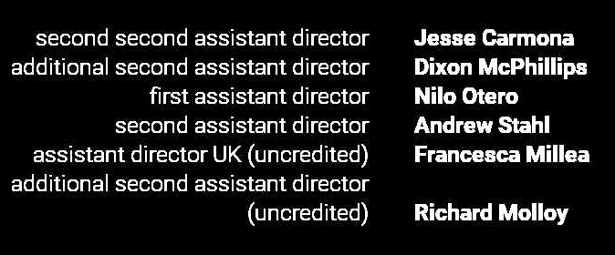
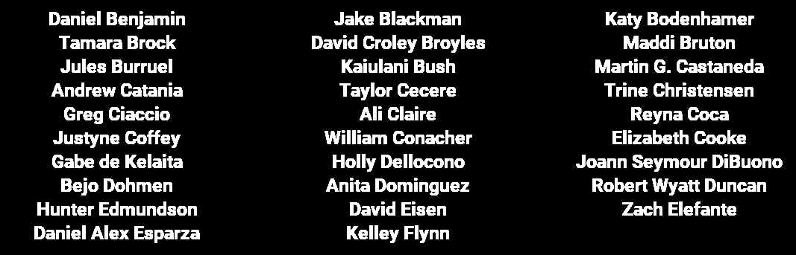

# credimator

This program creates video credits from a simple textfile. 
Simply write your content in the program-specific [syntax](#syntax) and it will generate your credits.

```
usage: credimator.py [-h] [-d] [-v] [-f] [--fonts] [--spacing] [--version] input [output]

positional arguments:
  input          input textfile to generate credits
  output         path to the generated video including filename

options:
  -h, --help     show this help message and exit
  -d             enable debug mode
  -v, --verbose  enable verbose
  -f, --force    enable force mode
  --fonts        print all available font types
  --spacing      print spacing for current file
  --version      show program's version number and exit
```

> **The file extension of the output file indicates the video format.**

Running `python credimator.py examples/oppenheimerShort.txt examples/example.mov` gets you 
[this example video](https://youtu.be/oIskOvIHzq0). This is an example of the latest version.

`examples/oppenheimerExample.txt` is a basic text file to show the latest syntax and options.

Running `python credimator.py examples/oppenheimerShort.txt examples/example.gif` gets you 
this video:


# Syntax
Every line starting with `#` is a comment. Lines that include `#` will be comments from the 
character until the end of line.

## Settings
The file starts with your video settings. Following settings are available:

> The general syntax is `<setting> = <value>`

* `width` -> video width *default: 1920*
* `height` -> video height *default: 1080*
* `background color` -> tuple in RGBA *default: (0, 0, 0, 1)*
* `text color` -> tuple in RGB *default: (255, 255, 255)*
* `fps` -> frame rate in frames per seccond *default: 25*
* `tuple style` -> set global style for blocktype tuple *default: rb*
* `box style` -> set global style for blocktype box *default: b*
* `table style` -> set global style for blocktype table *default: b*
* `text style`-> set global style for blocktype text *default: b*
* `text size` -> text size in px
* `line space` -> line space in px
* `speed` -> video speed depending on fps
* `box separator` -> separator used in blocktype box
* `border` -> border to the left and right video edges in px
* `tuple space` -> space between left and right site in block tuple
* `block offset` -> space between at the end of a block to the next block
* `bold font` -> bold font needed for the style
* `regular font` -> regular font needed for the style
* `enable signature` -> enable the program to write a signature at the end of your credits  *default: True*

>Note: The order of the settings is irrelevant but look after your spelling as this is what
>the program uses to link the settings

>The global style for each blocktype can be overwritten by the block definition


## Block definition
Each block has a type. The type can be *tuple*, *table*, or *box*. These types define which
text layout to choose. All settings except for the blocktype are optional. Pay attention that you can 
not define a headline without a headline type.

The block definition looks like this:

```
*headline*(headlinetype, blocktype, block style, block spacing){

    content

}
```
If your blocktype is *tuple* you have to use the following definition:

```
*headline*(headlinetype, blocktype, block style, block spacing){
    
    left content: right content

}
```
If you only want to add a headline do not enter any content. The program will generate a single headline.
Currently you still have to enter a blocktype even if you only want to enter a headline.

You can use as much whitespace as you want as it will be ignored.

If the left content of your tuple is too long to fit in a line there will be a newline fot the rest.
The right content of a tuple will be placed at the last line of the left content.

The layout is completely made by the program but you have options to influence it. The main way to do so
is by changing `block offset`. This defines the space that is to the end of a block. This area has no
content. If you want your blocks to have a bigger offset simply increase the value of `block offset`.
The space between a previous block and a headline is calculated by the program depending on the headline type
that you enter. Also the space between the headline and the following block content depends on the 
headline type.

>Note: `block offset` is always added to your block mo matter which headline type your next block uses.

## Blocktypes
### Tuple

The blocktype *tupel* arranges the input as two columns that have a line with no content inbetween.
Following is the syntax:

```
left content: right content
```

The left and right content have to be separated by *:*. You can have more than only one content on 
the left side. The programm will fit everything into one line and add a new line if it does not fit.
The right side content will be listed together with the last row of left content.
If you want to add a new line to your table simply write *§*



### Table
The block type *table* displays the content in two or three columns. The number of columns can be specified in the block definition. If it is not specified, an automatic number is selected. If the number of words in the block is more than 24, the content is displayed in 3 columns.

```
(table, [2,3]){
    content1
    content2
    content3
}
```
Each row will be one item in the table. The table is filled from left to right and top to bottom.



### Box
The content of a line in the block type *box* is displayed separated by the *boxseperator*. 
A line is filled up until it is full and a new line is started. The dafault boxseperator is •.


### Text
You can use block type *text* to simply show plain text. Use *§* to start a new line as new lines
in the inputfile will be ignored.


## Influence layout
The general layout of your block is defined by your blocktype. But there are options for you to 
customize some stuff.

In blocktype *tuple* you can add a newline to your text by writing `§` in a single line.

You can also define the seperator between each word in blocktype *box*. Simply change the 
setting *box separator* to the character you want.

You can also add a tuple of five values to every block to effect the spacing of the block.
If you add a tuple of values, the order of the values is relevant. 

> (headlineTopSpace, headlineTextSpace, textSize, lineSpace, blockOffset)

You do not have to assign a value to every field, but you need a five-value tuple.
Simply set the field to -1 to not assign a value.

You can also add the tuple to a single headline to affect its layout.

### Block style
To define the style of your block, simply add a style to your block definition. Following 
styles are available:

* **tuple**: rb, br, bb, rr
* **box**: b, r
* **table**: b, r
* **text**: b, r

> **r** means *regular* and **b** means *bold*
